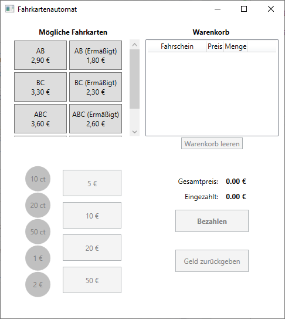
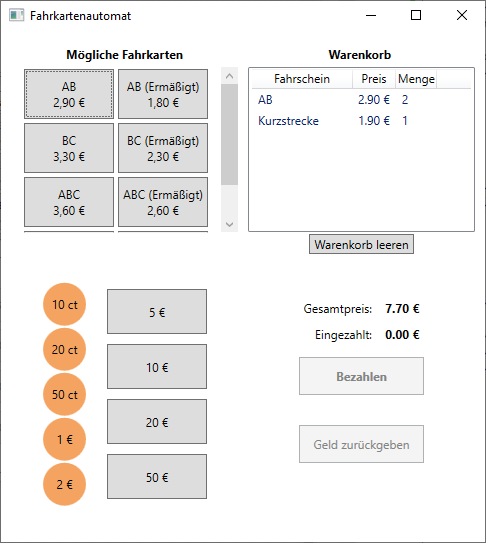

# WPF-Fahrkartenautomat
Simpler "Fahrkartenautomat" mit WPF nach MVVM Muster.

View: MainWindow.xaml  
ViewModel: ViewModel.MainWindowViewModel

Hinzufügen von Fahrkarten oder Zahlungsmitteln über die Definitions.cs

## Bilder

### Start des Programms

### Auswahl der Tickets

### Bezahlvorgang

